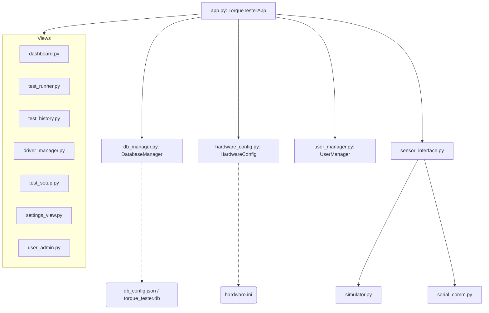

# 🔧 Torque Tester & Calibration System

> **Version 1.0.0** | Python 3.14 | Windows 10/11  
> Industrial torque tool auditing, peak-torque measurement, and QA compliance logging platform.

---

## Table of Contents

1. [Executive Summary](#1-executive-summary)
2. [Functional Description](#2-functional-description)
3. [Technical Architecture](#3-technical-architecture)
4. [Hardware Integration](#4-hardware-integration)
5. [Installation and Deployment](#5-installation-and-deployment)
6. [Configuration Management](#6-configuration-management)
7. [Database Documentation](#7-database-documentation)
8. [Source Code Documentation](#8-source-code-documentation)
9. [Maintenance Guide](#9-maintenance-guide)
10. [Security and Access](#10-security-and-access)
11. [Testing Documentation](#11-testing-documentation)
12. [Business Continuity](#12-business-continuity)
13. [Future Development Roadmap](#13-future-development-roadmap)
14. [Appendices](#14-appendices)

---

## 1. Executive Summary

### Purpose of the Application
The **Torque Tester & Calibration System** is a high-reliability industrial desktop application designed for precise torque tool auditing, calibration tracking, and QA compliance logging. The system connects to physical torque measurement sensors via serial/USB interfaces, reads real-time torque values, evaluates peak readings against configurable tolerance bands, and stores auditable session records with operator attribution.

### Business Process Supported
The application supports the **tool calibration and quality assurance workflow** within manufacturing and assembly operations:
- Ensuring torque tools (electric, pneumatic, manual click) meet specified tightening force tolerances.
- Recording calibration date windows and triggering due-date notifications.
- Generating audit trails linking operators, tools, workbenches, and test outcomes.
- Providing a structured pass/fail workflow with minimum-sample and minimum-OK-sample rules to enforce quality gates.

### Main Users

| Role | Typical User |
|---|---|
| **Operator** | Assembly line technicians who perform tool tests |
| **Supervisor** | Quality engineers who register tools and define procedures |
| **Administrator** | IT or quality system administrators who manage users, hardware, and database connections |

### Criticality to Operations
- **Medium-High**: The system directly supports tool qualification and traceability requirements. Loss of the application or its database would disrupt tool re-qualification workflows and potentially invalidate calibration records.
- The design uses separate machine-local configuration files (`hardware.ini`, `db_config.json`) to allow the central database (SQLite or SQL Server) to be shared across workstations without machine-specific coupling.

---

## 2. Functional Description

### Complete Feature List

| Feature | Description |
|---|---|
| **User Login & Session Management** | Secure login with bcrypt-hashed passwords, session-level user tracking |
| **Driver Registry** | Register, edit, clone, and search torque drivers with calibration dates and model data |
| **Procedure Templates** | Define, clone, and search QA test procedures with tolerance and sample count rules |
| **Dashboard** | Barcode-scan or select driver, choose workbench and test template to initiate a test session |
| **Test Runner** | Live torque feed with visual needle gauge, auto snap-back peak capture, sample log table |
| **Test History** | Filterable audit table with Driver ID, Workbench, Operator, Result, Date filters; CSV export |
| **Settings — Hardware** | Per-tester COM port, baud rate, model, simulator toggle; supports up to 8 tester slots |
| **Settings — Database** | Switch between local SQLite and remote SQL Server at runtime |
| **Settings — Data Management** | CSV export/import per table; full test record wipe with pre-wipe CSV backup |
| **User Administration** | Create, edit, deactivate users; password reset (Admin only) |

### Workflow Diagram

```
[Login] ──► [Dashboard]
                │
         ┌──── Select Driver ID (scan/type) ────┐
         │     Select Workbench                  │
         │     Select Test Template              │
         └──────────────────────────────────────┘
                │
           [Test Runner]
                │
         ┌── Live sensor polling (150 ms)
         │── Snap-back peak capture state machine
         │── Sample logged on peak CAPTURED
         │── Session completes when Max Samples reached
         └── OR operator clicks "Finish" (≥ Min Samples)
                │
         [Session Saved to Database]
                │
           [Test History] ◄──── Filterable, CSV-exportable
```

### User Interface Explanation

- **Sidebar Navigation**: Fixed left-side icon+label navigation bar. Highlighted active view. Role-based tab visibility (e.g., Settings hidden from Operators).
- **Dark Theme**: Full dark mode with CustomTkinter rendering engine; high-contrast status indicators (green = PASS/online, red = FAIL/offline, orange = ABORTED/warning).
- **Status Bar**: Bottom persistent bar showing active workbench name and per-tester sensor connection status updated every 2 seconds.
- **Responsive Tables**: `ScrollableTable` component built on CustomTkinter grid frames with sortable column weights and inline action buttons (View, Edit, Clone, Delete).

### Data Flow Description

```
Physical Sensor (RS-232/USB)
       │
       ▼
serial_comm.py  ──► read_torque() ──► cNm float
       │
       ▼
test_runner.py  ──► snap-back state machine
       │              └──► on CAPTURED → log sample
       ▼
db_manager.py  ──► INSERT test_measurements
                    UPDATE test_sessions.overall_result
```

---

## 3. Technical Architecture

### Technology Stack

| Component | Technology | Version |
|---|---|---|
| Language | Python | 3.14 |
| UI Framework | CustomTkinter | ≥ 5.2.0 |
| Serial Communication | PySerial | ≥ 3.5 |
| Password Hashing | bcrypt | ≥ 4.0.0 |
| Local Database | SQLite3 | Built-in |
| Remote Database | Microsoft SQL Server | via pyodbc |
| Packaging | PyInstaller | 6.21.0 |
| Config Files | Python configparser (INI) / JSON | Built-in |

### Folder and File Structure

```
torque_tester/
│
├── main.py                  # Entry point: DPI setup, DB init, app launch
├── app.py                   # App shell: view routing, sensor reconnect, status bar
├── config.py                # Global constants: paths, access levels, test types, defaults
├── hardware_config.py       # Hardware INI read/write manager (hardware.ini)
├── requirements.txt         # Python package dependencies
├── torque_tester.spec       # PyInstaller build specification
├── build.bat                # Helper batch script to run PyInstaller
│
├── auth/
│   ├── login_view.py        # Login screen UI
│   └── user_manager.py      # User auth: bcrypt hashing, session, access level check
│
├── database/
│   ├── db_manager.py        # SQLite + SQL Server manager, schema migrations, CRUD
│   └── models.py            # Dataclass row wrappers (TorqueDriver, TestDefinition, etc.)
│
├── sensor/
│   ├── sensor_interface.py  # Abstract base class for all sensor backends
│   ├── serial_comm.py       # Real hardware: RS-232 reader, scientific notation parser
│   └── simulator.py         # Software simulator: generates synthetic torque waveforms
│
├── utils/
│   ├── helpers.py           # Shared formatting utilities (datetime, cNm display)
│   └── logger.py            # Rotating file logger setup
│
├── views/
│   ├── components.py        # Reusable ScrollableTable widget
│   ├── dashboard.py         # Session initialization screen
│   ├── driver_manager.py    # Driver registry CRUD
│   ├── settings_view.py     # Hardware, DB connection, data management settings
│   ├── test_history.py      # Session audit log with filters and CSV export
│   ├── test_runner.py       # Live test execution: gauge, samples, snap-back engine
│   ├── test_setup.py        # Procedure template CRUD
│   └── user_admin.py        # User account management (Admin only)
│
├── dist/
│   ├── TorqueTester.exe     # Compiled single-file executable (PyInstaller)
│   ├── hardware.ini         # Machine-local sensor config (not committed to git)
│   ├── db_config.json       # Database connection config (not committed to git)
│   └── documentation/
│       ├── app_documentation.md
│       ├── technical_report.md
│       └── walkthrough.md
│
├── hardware.ini             # (Runtime) Machine-local hardware config — gitignored
├── db_config.json           # (Runtime) DB connection config — gitignored
└── logs/
    └── app.log              # Rotating application log — gitignored
```

### System Architecture Diagram



---

## 4. Hardware Integration

### Torque Measurement Equipment Details

The system is designed and tested with the **ng-TTS50-xu** series rotary torque transducer:

| Specification | Value |
|---|---|
| Model | ng-TTS50-xu |
| Measurement Range | 0 – 50 Nm (ng-TTS500-xu: 0 – 500 Nm) |
| Interface | RS-232 / USB (via FTDI or CH340 converter) |
| Data Format | ASCII stream, newline-terminated |
| Frame Rate | Continuous (hardware-driven) |

### Communication Protocols

**Interface type: RS-232 serial (USB emulated)**

Default serial parameters (stored in `hardware.ini`):

| Parameter | Value |
|---|---|
| Baud Rate | `115200` |
| Data Bits | `8` |
| Parity | `None` |
| Stop Bits | `1` |
| Flow Control | `None` |
| Timeout | `1.0 s` |

### Frame Format

The sensor continuously streams ASCII frames bounded by control characters:
- **STX** (Start of Text): `0x06`
- **ETX** (End of Text): `0x08`

Frame payload layout:  
`[Mode (1 char)] [Torque Field (10 chars)] [Aux Fields...]`

- **Idle**: Torque field = `"IDLE      "`
- **Active**: Torque field = `"+08021E-05"` → parsed as `+0.08021 Nm` → scaled to `8.02 cNm`

### Custom Sensor Support

Any sensor outputting newline-terminated ASCII can be connected using **Custom mode**:
1. Select `Custom...` in the tester model dropdown.
2. Enter a **regex pattern** that captures the numeric torque value, e.g.:
   ```
   ([+-]?\d+\.\d+)\s*Nm
   ```
3. Set custom min/max torque bounds for the visual gauge.

### Calibration Considerations

- Each torque driver registered in the system stores `calibration_date` and `calibration_due` dates.
- The dashboard and driver registry visually flag drivers whose calibration is overdue.
- The physical sensor itself should be calibrated on a schedule defined by the sensor manufacturer; re-calibration data is not stored in this system.

---

## 5. Installation and Deployment

### System Requirements

| Requirement | Minimum |
|---|---|
| OS | Windows 10 / 11 (64-bit) |
| Python | 3.12+ (3.14 recommended) |
| RAM | 256 MB available |
| Disk | 100 MB (excluding database growth) |
| USB | 1× USB port for sensor (if not using simulation) |
| SQL Server | Optional – only if using a central database |

### Dependency Installation

```powershell
# Clone the repository
git clone https://github.com/pintoan-olympus/Torque-Tester.git
cd Torque-Tester

# Install Python dependencies
pip install -r requirements.txt
```

**`requirements.txt`:**
```
customtkinter>=5.2.0
pyserial>=3.5
bcrypt>=4.0.0
```

For SQL Server connectivity (optional):
```powershell
pip install pyodbc
```

### Environment Setup

No `.env` file is required. Configuration is managed via:
- `hardware.ini` — auto-created on first launch with safe defaults (simulator mode ON)
- `db_config.json` — auto-created pointing to a local SQLite database

### Running the Application

```powershell
python main.py
```

On first launch:
1. The SQLite database `torque_tester.db` is created automatically.
2. A default admin account (`admin` / `admin`) is seeded — **change immediately**.
3. `hardware.ini` is generated with simulator mode enabled on COM1/COM2.

### Build and Packaging Process

To compile a single-file Windows executable:

```powershell
# Using the batch helper
build.bat

# Or directly with PyInstaller
pyinstaller --clean torque_tester.spec
```

Output: `dist/TorqueTester.exe` (~13 MB self-contained executable).

The `.spec` file bundles:
- All Python modules and views
- CustomTkinter theme assets
- Tcl/Tk runtime
- bcrypt and pyserial binaries
- `python314.dll`

> **Note**: `hardware.ini`, `db_config.json`, `torque_tester.db`, and `logs/` are **not bundled**. They are created at runtime next to the executable, keeping machine-local data separate from the distributed binary.

---

## 6. Configuration Management

### `hardware.ini` — Hardware Configuration

Created automatically on first launch next to the executable. **Not committed to version control.**

```ini
[general]
tester_count = 2

[tester_a]
port = COM1
baudrate = 115200
bytesize = 8
parity = N
stopbits = 1
timeout = 1.0
simulator_mode = true
tester_model = ng-TTS50-xu
custom_model_name = My Sensor
custom_torque_min = 0.0
custom_torque_max = 50.0
custom_serial_pattern = ([+-]?\d+\.\d+)\s*Nm

[tester_b]
port = COM2
baudrate = 115200
...
```

Additional tester slots (`[tester_c]`, `[tester_d]`, ...) are appended dynamically via the Settings UI.

### `db_config.json` — Database Connection

```json
{
  "db_type": "sqlite",
  "sqlite_path": "C:\\path\\to\\torque_tester.db",
  "sql_server_conn_str": ""
}
```

For SQL Server, set `db_type` to `"sql_server"` and populate `sql_server_conn_str` with an ADO.NET-style connection string, e.g.:
```
Server=MY_SERVER;Database=TorqueDB;Trusted_Connection=yes;
```

### Parameter Reference

| Parameter | File | Description |
|---|---|---|
| `tester_count` | hardware.ini `[general]` | Number of active tester slots (2–8) |
| `port` | hardware.ini `[tester_*]` | COM port identifier (e.g. `COM3`) |
| `baudrate` | hardware.ini `[tester_*]` | Serial baud rate (default `115200`) |
| `simulator_mode` | hardware.ini `[tester_*]` | `true` = use software simulator |
| `tester_model` | hardware.ini `[tester_*]` | `ng-TTS50-xu`, `ng-TTS500-xu`, or `Custom...` |
| `custom_serial_pattern` | hardware.ini `[tester_*]` | Regex for custom sensor line parsing |
| `db_type` | db_config.json | `sqlite` or `sql_server` |
| `sqlite_path` | db_config.json | Full path to `.db` file |
| `sql_server_conn_str` | db_config.json | pyodbc connection string |

---

## 7. Database Documentation

### Database Type
- **Primary**: SQLite 3 (`torque_tester.db`) — zero-configuration, file-based, suitable for single-workstation deployments.
- **Optional**: Microsoft SQL Server — for multi-workstation shared-database deployments. Switched at runtime via `db_config.json`.

### Schema Diagram

```
users                    torque_drivers              test_definitions
──────────────           ──────────────────          ─────────────────────
id (PK)                  id (PK)                     id (PK)
username (UQ)            driver_id (UQ)              name
password_hash            driver_type                 test_type
full_name                brand                       target_value
access_level             model                       tolerance_plus
active                   torque_min / max            tolerance_minus
created_at               workbench                   num_samples
                         calibration_date/due        min_samples
                         default_test_def_id ──────► id
                         handedness
                         active

test_sessions                        test_measurements
─────────────────────                ─────────────────────
id (PK)                              id (PK)
driver_id (FK) ──► torque_drivers    session_id (FK) ──► test_sessions
test_def_id (FK) ──► test_defs       sample_number
workbench                            measured_value (signed cNm)
operator_id (FK) ──► users           result (OK / NOK)
started_at                           timestamp
completed_at
overall_result (PASS/FAIL/ABORTED)
```

### Table Descriptions

| Table | Purpose |
|---|---|
| `users` | Authorized system users with bcrypt-hashed passwords and access level |
| `torque_drivers` | Tool registry: specifications, calibration window, assigned test procedure |
| `test_definitions` | QA procedure templates: target torque, tolerances, sample count rules |
| `test_sessions` | Audit records of completed test cycles |
| `test_measurements` | Individual torque readings captured during each session |

### Backup and Recovery

**Export via Settings UI:**
- Navigate to **Settings → Data Management**.
- Click **Export** on any table to download a timestamped CSV.
- Before wiping records, the system automatically generates a full backup CSV.

**Manual SQLite backup:**
```powershell
Copy-Item torque_tester.db torque_tester_backup_$(Get-Date -Format yyyyMMdd).db
```

**SQL Server backup:** use your organisation's standard SQL Server backup procedures (full backup recommended nightly).

---

## 8. Source Code Documentation

### Module Descriptions

| Module | Responsibility |
|---|---|
| `main.py` | Process entry point, DPI awareness, app lifecycle |
| `app.py` | MVC controller: view routing, sensor management, status bar |
| `config.py` | Centralised constants: paths, access levels, test types, defaults |
| `hardware_config.py` | INI-based hardware settings manager |
| `auth/login_view.py` | Login UI with credential validation |
| `auth/user_manager.py` | bcrypt hashing, current-user session, role checks |
| `database/db_manager.py` | All DB operations: connection pooling, CRUD, schema migration |
| `database/models.py` | Typed dataclasses mapping DB rows to Python objects |
| `sensor/sensor_interface.py` | Abstract interface defining the sensor API contract |
| `sensor/serial_comm.py` | Physical sensor: RS-232 reader, frame parser, peak tracking |
| `sensor/simulator.py` | Software simulator generating synthetic torque curves |
| `utils/helpers.py` | Datetime formatting, cNm display helpers |
| `utils/logger.py` | Rotating file logger (16 KB tail read for UI log viewer) |
| `views/components.py` | `ScrollableTable` reusable grid widget |
| `views/dashboard.py` | Session setup: driver select, workbench, template picker |
| `views/driver_manager.py` | Driver CRUD: register, edit, clone, search, delete |
| `views/test_setup.py` | Procedure template CRUD |
| `views/test_runner.py` | Live test: gauge, snap-back engine, sample log |
| `views/test_history.py` | Audit log with filters, detail popup, CSV export |
| `views/settings_view.py` | Hardware tabs, DB connection, data management |
| `views/user_admin.py` | User management: create, edit, deactivate, password reset |

### Key Algorithms

#### Auto Peak Snap-Back State Machine (`test_runner.py`)

```
States: IDLE → RISING → CAPTURED → IDLE

IDLE:      torque > max(0.5, 0.15 × target)          → RISING
RISING:    torque < peak × 0.85
           AND peak − torque ≥ 0.5 cNm               → CAPTURED (log sample)
CAPTURED:  torque < max(0.3, 0.08 × target)           → IDLE
```

#### Serial Frame Parser (`serial_comm.py`)

```
1. Read bytes until ETX (0x08) delimiter found
2. Decode ASCII payload
3. If payload contains "IDLE" → return 0.0
4. Extract 10-char scientific field (e.g. "+08021E-05")
5. Parse to float → multiply × 100.0 → return cNm value
```

#### Custom Regex Parser (`serial_comm.py`)

```
1. Read line via readline()
2. Apply compiled re.search(pattern, line)
3. Extract group(1) → parse to float → multiply × 100.0
```

---

## 9. Maintenance Guide

### Logging

| Log | Location | Contents |
|---|---|---|
| Application log | `logs/app.log` (next to executable or script) | All INFO, WARNING, ERROR events with timestamps |
| UI log viewer | Settings → Hardware tab | Last 16 KB of `app.log`, Serial RX lines filtered out |

Log rotation is handled automatically (10 MB max per file, 5 backup files retained).

### Common Failure Scenarios

| Symptom | Likely Cause | Fix |
|---|---|---|
| Tester shows OFFLINE | Wrong COM port or baud rate | Settings → Tester tab → update port/baud → Save & Reconnect |
| Tester shows OFFLINE | Another app has the COM port | Close PuTTY, Arduino IDE, or any other serial terminal |
| Tester shows OFFLINE | USB driver not installed | Install FTDI or CH340 driver from Device Manager |
| `0.00 cNm` only | Simulator mode still ON | Settings → Tester → uncheck Simulator Mode |
| Garbled serial data | Baud mismatch | Set baud to `115200` (ng-TTS50-xu default) |
| Login fails | Wrong password | Admin resets password via User Admin |
| DB connection fails | Wrong SQL Server string | Settings → Database → verify connection string |
| App crashes on start | `python314.dll` not found | Run the compiled `TorqueTester.exe` (includes DLLs) instead of `python main.py` |
| Settings not persisting | `hardware.ini` is read-only | Check file permissions next to executable |

### Diagnostic Methods

1. **Check `logs/app.log`** — all errors, connection attempts, and setting changes are logged.
2. **Settings → Raw Frame feed** — shows the exact bytes arriving from the sensor in real time.
3. **Run `verify_imports.py`** — confirms all Python modules import cleanly after code changes.

---

## 10. Security and Access

### User Roles

| Level | Role | Capabilities |
|---|---|---|
| 1 | **Operator** | Execute tests, view history |
| 2 | **Supervisor** | + Manage drivers and test templates, export CSV |
| 3 | **Admin** | + Manage users, configure hardware, import data, wipe records |

### Permissions

- Access level is enforced in every view using `user_manager.has_access(level)`.
- Sidebar navigation items are hidden or shown based on the logged-in user's level.
- Settings hardware tabs are fully disabled (read-only widgets) for Operators and Supervisors.

### Credential Management

- Passwords are hashed with **bcrypt** (cost factor 12) — plaintext passwords are never stored.
- The default seed account (`admin` / `admin`) **must be changed or deactivated** immediately after first deployment.
- Password reset is available to Admins only via **User Administration → Edit User**.

### Security Considerations

- The application does **not** use network communication (no REST API, no HTTP). Attack surface is limited to local file system and serial port.
- SQLite database files are not encrypted at rest. For regulated environments, consider full-disk encryption (BitLocker) or migrating to SQL Server with TDE.
- SQL Server connection strings stored in `db_config.json` include credentials in plaintext — restrict file-system access to authorised personnel only.

---

## 11. Testing Documentation

### Running Import Verification

```powershell
python verify_imports.py
```
Verifies all 19 project modules import without errors. Run this after any code change before committing.

### Test Procedures

| Test | Procedure |
|---|---|
| Sensor simulation | Enable Simulator Mode in Settings; launch Test Runner; confirm torque values increment and snap-back samples are logged automatically |
| Serial communication | Connect ng-TTS50-xu to configured COM port; disable Simulator Mode; confirm ONLINE status and live cNm readings in Settings raw frame feed |
| Pass/fail logic | Create a test definition with tight tolerances; run a session with known good and known bad readings; verify overall result matches Min OK criteria |
| User access | Log in as each role (Operator, Supervisor, Admin); confirm unavailable menu items are hidden |
| DB switch | Change to SQL Server connection in Settings; restart app; confirm data persists and new sessions are recorded |
| CSV export | Apply filters in Test History; click Export History; verify CSV contains only filtered records |

### Acceptance Criteria

- All `verify_imports.py` checks pass: ✅ `SUCCESS: All modules imported successfully without errors!`
- Simulated test session completes with correct PASS/FAIL/ABORTED result.
- Hardware settings persist across app restarts (read from `hardware.ini`).
- No SQL errors in `logs/app.log` during normal operation.

---

## 12. Business Continuity

### Known Risks

| Risk | Impact | Likelihood |
|---|---|---|
| `torque_tester.db` corruption or deletion | Loss of all test history | Low (SSD failure / accidental delete) |
| ng-TTS50-xu hardware failure | No physical measurement capability | Medium |
| Python 3.14 incompatibility with future packages | App cannot be updated without re-testing | Low-Medium |
| Single-workstation SQLite deployment | No redundancy or concurrent access | Medium (if multi-user needed) |

### Single Points of Failure

- **SQLite database file**: No built-in replication. Mitigate with scheduled file copy backups.
- **Serial hardware**: No hot-swap retry beyond manual reconnect. Simulator mode available as fallback.
- **Single executable**: If `TorqueTester.exe` is deleted, rebuild from source with `pyinstaller torque_tester.spec`.

### Recovery Procedures

1. **Database loss**: Restore from latest CSV exports (Settings → Data Management → Export). Re-import using the Import function.
2. **Executable loss**: Re-run `pyinstaller --clean torque_tester.spec` from source.
3. **Settings loss**: `hardware.ini` and `db_config.json` will be recreated with defaults on next launch. Re-enter COM port and baud rate settings via the Settings UI.
4. **Source code loss**: Clone from GitHub: `git clone https://github.com/pintoan-olympus/Torque-Tester.git`

### Knowledge Transfer Recommendations

- Ensure at least **2 personnel** are trained to administer the system (user management, hardware config, DB backup).
- Keep a copy of this README and the `dist/documentation/` folder on a shared drive.
- Document site-specific COM port assignments and SQL Server connection strings in a local runbook stored separately from this repository.

---

## 13. Future Development Roadmap

### Improvement Opportunities

| Area | Recommendation |
|---|---|
| **Multi-workstation** | Migrate default deployment to SQL Server; add workstation ID tagging to sessions |
| **Reporting** | Add PDF report generation per driver (calibration certificate-style output) |
| **Barcode scanning** | Integrate USB HID barcode reader support for hands-free driver selection |
| **Calibration alerts** | Add email/notification trigger when calibration due date is within N days |
| **Live dashboard** | Add a supervisor overview screen showing all active workbench sessions in real time |
| **OPC-UA / Modbus** | Abstract `sensor_interface.py` to support OPC-UA or Modbus TCP sensors for PLC-integrated environments |
| **Audit log** | Add a dedicated user-action audit log table for regulatory traceability |
| **Auto-update** | Implement a version check against GitHub releases for simple update notification |

### Technical Debt

- `test_settings_crash.py` and `verify_imports.py` are developer utility scripts — should be moved to a `dev_tools/` directory and excluded from releases.
- `config.py` still contains `DEFAULT_COMM_SETTINGS` dict that was previously used for database seeding; this can be simplified now that `hardware.ini` handles defaults.
- The `.spec` file includes macOS-specific library warning suppressions that are not needed for a Windows-only build.

### Recommended Refactoring Areas

- Extract the snap-back state machine from `test_runner.py` into a standalone `peak_capture.py` module for independent unit testing.
- Add type annotations consistently across all modules (partially done in `db_manager.py`).
- Replace ad-hoc inline widget construction in `settings_view.py` with a reusable `TesterConfigPanel` component.

---

## 14. Appendices

### Version History

| Version | Date | Changes |
|---|---|---|
| `v1.0.0` | 2026-07-08 | Initial release: full feature set including multi-sensor support, hardware.ini migration, test history CSV export, driver/template clone, search, and compiled executable |

### Configuration Example — `hardware.ini`

```ini
[general]
tester_count = 2

[tester_a]
port = COM7
baudrate = 115200
bytesize = 8
parity = N
stopbits = 1
timeout = 1.0
simulator_mode = false
tester_model = ng-TTS50-xu
custom_serial_pattern = ([+-]?\d+\.\d+)\s*Nm

[tester_b]
port = COM8
baudrate = 115200
bytesize = 8
parity = N
stopbits = 1
timeout = 1.0
simulator_mode = true
tester_model = ng-TTS500-xu
```

### Configuration Example — `db_config.json`

```json
{
  "db_type": "sql_server",
  "sqlite_path": "",
  "sql_server_conn_str": "Server=PROD-SQL01;Database=TorqueQA;Trusted_Connection=yes;"
}
```

### Hardware Interfaces Summary

| Interface | Supported | Notes |
|---|---|---|
| RS-232 Serial (USB) | ✅ | Via FTDI/CH340 USB-Serial adapter |
| Custom ASCII Serial | ✅ | Any sensor with configurable regex pattern |
| Simulator (software) | ✅ | Built-in; enabled by default |
| Ethernet / OPC-UA | ⬜ | Not yet implemented (roadmap item) |
| Modbus TCP/RTU | ⬜ | Not yet implemented (roadmap item) |

### Documentation Index

| Document | Location |
|---|---|
| Application Documentation | `dist/documentation/app_documentation.md` |
| Technical Report | `dist/documentation/technical_report.md` |
| Feature Walkthrough | `dist/documentation/walkthrough.md` |
| This README | `README.md` (repository root) |
