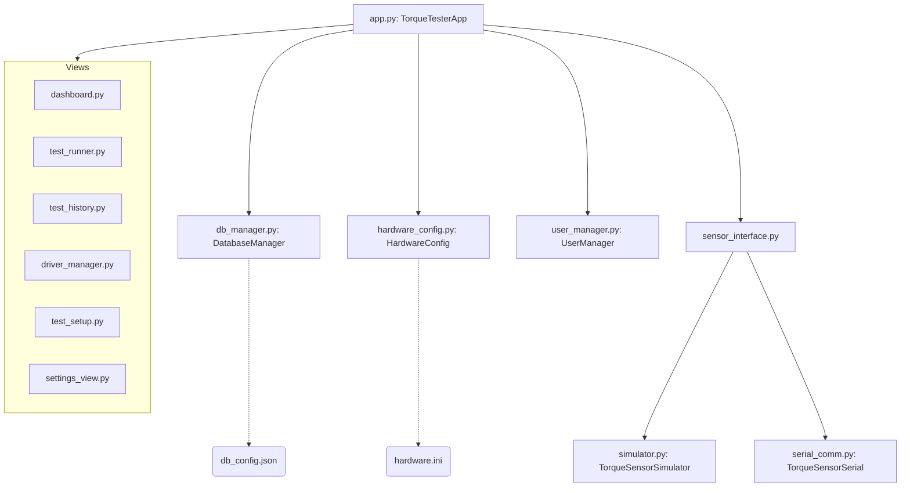

# Torque Tester & Calibration System Documentation

This document provides comprehensive technical, architectural, and operator documentation for the **Torque Tester & Calibration System** application.

---

## 1. System Overview

The Torque Tester & Calibration System is a desktop application built with Python and **CustomTkinter** for high-precision tool calibration, peak torque tracking, and quality assurance logging. It interfaces with physical torque sensors (specifically modeling the **ng-TTS50-xu** torque sensor) to parse real-time torque values, perform tolerance checks, and log detailed audit history.

### 🏗️ High-Level Architecture

The application is structured around a decoupled Model-View-Controller (MVC) paradigm, with machine-local configurations stored in flat files and relational data kept in database systems:



*   **`hardware.ini`**: Stores all machine-local hardware and port configurations (COM ports, baud rates, simulator modes, models, and custom serial parse regexes) under clean sections (`[general]`, `[tester_a]`, `[tester_b]`, etc.).
*   **`db_config.json`**: Stores connection parameters to either the local SQLite database file or the remote SQL Server database.
*   **Database**: Stores only relational operational records (Users, Drivers, Test Procedures, Test Sessions, and Measurements).


---

## 2. 🔐 User Access Control

The system implements a rigid 3-level security clearance model to enforce data integrity and restrict critical actions:

| Access Level | Role | Permitted Actions |
| :---: | :--- | :--- |
| **1** | **Operator** | <ul><li>Scan/Select Torque Drivers</li><li>Execute Test Sessions</li><li>View Test History details</li></ul> |
| **2** | **Supervisor** | <ul><li>*All Operator capabilities*</li><li>Register/Edit Torque Drivers</li><li>Manage default test templates</li><li>Export session CSV files</li></ul> |
| **3** | **Admin** | <ul><li>*All Supervisor capabilities*</li><li>Create/Edit User accounts</li><li>Reset user passwords</li><li>Modify serial port communication settings</li><li>Toggle simulator modes</li><li>Import databases from CSV</li></ul> |

> [!WARNING]
> By default, the database seeds an admin account with username `admin` and password `admin`. Administrators should deactivate or change the password of this seed account immediately upon deploying the software.

---

## 3. 🗄️ Database Schema

The database uses SQLite (`torque_tester.db`) with automatic migrations on startup.

### Table: `users`
Tracks authorized system users and security levels.
*   `id`: INTEGER (Primary Key, Autoincrement)
*   `username`: TEXT (Unique)
*   `password_hash`: TEXT
*   `full_name`: TEXT
*   `access_level`: INTEGER (1: Operator, 2: Supervisor, 3: Admin)
*   `active`: BOOLEAN (Default 1)
*   `created_at`: DATETIME

### Table: `torque_drivers`
Holds parameters for industrial torque drivers undergoing test.
*   `id`: INTEGER (Primary Key, Autoincrement)
*   `driver_id`: TEXT (Unique identifier code)
*   `driver_type`: TEXT (Electric, Pneumatic, Manual Click, etc.)
*   `brand`: TEXT
*   `model`: TEXT
*   `torque_min`: REAL (cNm limits)
*   `torque_max`: REAL (cNm limits)
*   `workbench`: TEXT
*   `calibration_date`: DATE (YYYY-MM-DD)
*   `calibration_due`: DATE (YYYY-MM-DD)
*   `notes`: TEXT
*   `active`: BOOLEAN (Default 1)
*   `default_test_def_id`: INTEGER (FK to `test_definitions.id`)
*   `handedness`: TEXT (Default 'right', options: 'right', 'left')

### Table: `test_definitions`
Defines QA testing procedures and acceptance limits.
*   `id`: INTEGER (Primary Key, Autoincrement)
*   `name`: TEXT (Unique)
*   `test_type`: TEXT (peak, click, preset, breakaway, residual)
*   `target_value`: REAL (cNm)
*   `tolerance_plus`: REAL (cNm)
*   `tolerance_minus`: REAL (cNm)
*   `num_samples`: INTEGER (Max samples, default 5)
*   `min_samples`: INTEGER (Min samples needed to manually finish, default 3)
*   `min_ok_samples`: INTEGER (Min passing measurements required for overall PASS)
*   `default_tester_id`: TEXT (Default 'A', options: 'A', 'B')
*   `instructions`: TEXT
*   `active`: BOOLEAN (Default 1)

### Table: `test_sessions`
Audit records representing a complete test cycle on a driver.
*   `id`: INTEGER (Primary Key, Autoincrement)
*   `driver_id`: INTEGER (FK to `torque_drivers.id`)
*   `test_def_id`: INTEGER (FK to `test_definitions.id`)
*   `workbench`: TEXT
*   `operator_id`: INTEGER (FK to `users.id`)
*   `started_at`: DATETIME (Default Current Timestamp)
*   `completed_at`: DATETIME (Null if aborted)
*   `overall_result`: TEXT (PASS, FAIL, ABORTED)

### Table: `test_measurements`
Individual samples collected during a test session.
*   `id`: INTEGER (Primary Key, Autoincrement)
*   `session_id`: INTEGER (FK to `test_sessions.id`)
*   `sample_number`: INTEGER (1-based index)
*   `measured_value`: REAL (cNm, signed based on driver handedness)
*   `result`: TEXT (OK, NOK)
*   `timestamp`: DATETIME (Default Current Timestamp)

---

## 4. 🔌 Physical Sensor Communication

### Serial Protocol (`serial_comm.py`)
The serial parser binds to the designated COM port and monitors the **ng-TTS50-xu** hardware streaming loop.
*   **Format**: Ascii frame, e.g. `+08021E-05 Nm` (representing raw Newton-meters).
*   **Prefix Parsing**: The parser handles the dynamic mode prefixes:
    *   Idle: `IDLE      `
    *   Active stream: replaces idle text with status code string (e.g. `+08021E-05`).
*   **Auto Scaling**: Values are parsed in `Nm` and scaled to `cNm` (multiplied by `100.0`) inside the serial reader.

### 🔄 Auto Capture Peak (Snap-Back)
The **Test Runner** view integrates a 3-state machine to automatically capture peak readings when torque snaps back (e.g., when a driver clutches/clicks).

```
   [ IDLE ] ──( Torque rises above start threshold )──> [ RISING ]
      ▲                                                    │
      │                                                    │ (Torque drops by 15%
      │                                                      AND absolute drop >= 0.5 cNm)
      │                                                    ▼
      └───( Torque drops below reset threshold )─── [ CAPTURED ]
```

*   **Start Threshold**: `max(0.5, 0.15 * target_value)`
*   **Reset Threshold**: `max(0.3, 0.08 * target_value)`
*   **Snap-Back Drop Criteria**: `current_torque < peak_torque * 0.85` and `peak_torque - current_torque >= 0.5 cNm`

---

## 5. 🛠️ Operations Guide

### 1. Test Session Initialization (Dashboard Flow)
To start a new test session, operators initialize settings in the following strict sequential order:
1.  **Driver ID (Scan or Select)**: Scan the driver barcode or choose the identifier tag. This will automatically pre-load the driver's details and retrieve its default assigned test template (if configured).
2.  **Workbench Name / ID**: Select the active workbench (e.g. `Assembly Bench 1`) from the dropdown of registered workbenches.
3.  **Select Test Template**: View or override the pre-selected QA procedure template before launching the test runner.

### 2. Driver Registry & Search Bar
*   **Search**: Operators can type in the real-time search bar at the top of the Driver Registry table. Typing dynamically filters the list across Driver ID, Brand, Model, Type, and Workbench fields.
*   **Hand Orientation (Handedness)**:
    *   **Right Hand (CW, +)**: Torque values remain positive.
    *   **Left Hand (CCW, -)**: Torque values are sign-flipped to negative values prior to saving to the SQLite/SQL Server databases. Tolerance validation logic handles absolute values transparently.

### 3. Test Setup View
Supervisors configure procedures by defining:
1.  **Tester Assignment**: Set the default tester (A or B).
2.  **Sample Count Criteria**:
    *   **Max Samples**: Absolute ceiling (session completes automatically).
    *   **Min Samples**: Floor count enabling the operator to finalize tests early.
    *   **Min OK to Pass**: Number of individual samples that must check OK for the session to receive a final `PASS`.

### 4. Settings & Data/Hardware Management
*   **Tester Tabs (Tester A, B, C...)**: Separate port settings, model descriptors (`ng-TTS50-xu`, `ng-TTS500-xu`, or `Custom...`), status checkers, and raw frame serial stream previews. Setting changes are immediately persisted locally to the `hardware.ini` config file.
*   **Database Location Tab**: Administrators can toggle connection types:
    *   *Local SQLite Database*: Path to the local SQLite database file.
    *   *Online SQL Server Database*: Connection string (e.g., ADO.NET/ODBC format). Saves connection properties in `db_config.json` next to the executable/scripts, allowing independent database bindings without affecting local sensor configs.
*   **Data Management Tab**: Exports tables to CSV, imports tables with upsert logic, or performs a secure wipe of session and measurement records (auto-generates a full CSV backup prior to clearing tables).

---

## 6. 🔌 Hardware Reference — ng-TTS50-xu Torque Sensor

The **ng-TTS50-xu** is a high-precision rotary torque sensor designed for tool calibration and quality auditing. It streams ASCII data over an RS-232 / USB serial emulator port.

### ⚙️ Default Communication Settings
COM port parameters are configured in the Settings view and persisted under the `[tester_*]` sections in `hardware.ini`:
*   **Baud Rate**: `115200`
*   **Data Bits**: `8`
*   **Parity**: `None`
*   **Stop Bits**: `1`
*   **Flow Control**: `None`

### 📄 Serial Protocol & Frame Format
The sensor continuously broadcasts ASCII frames bounded by Control characters:
*   **STX (Start of Text)**: `0x06`
*   **ETX (End of Text)**: `0x08` (used as frame terminator)

#### Payload Frame Layout
A complete frame payload (excluding STX/ETX) consists of the following elements:
`[Mode (1 char)][Status/Torque Field (10 chars)][Auxiliary Fields...]`

*   **Mode Char**: Typically `'A'` for active streaming.
*   **Status/Torque Field**:
    *   When **Idle** (no torque applied), this field outputs text containing `"IDLE      "`.
    *   When **Active** (torque applied), this field changes to a 10-character scientific notation value, e.g. `+08021E-05` (representing `+0.08021 Nm`).
*   **Scaling to cNm**: The application reads the first scientific field, parses it to a float (`Nm`), and automatically scales it to Centinewton-meters (`cNm`) by multiplying by `100.0` (yielding `+8.02 cNm`).

### 🛠️ Troubleshooting Checklist
If the status monitor displays **OFFLINE** or raw frame feeds remain empty:
1.  **COM Port Conflicts**: Verify no other application (e.g. Putty, Arduino Serial Monitor) has locked the same COM port.
2.  **USB Driver**: Ensure the USB-to-Serial converter driver (typically FTDI or CH340) is recognized in Windows Device Manager.
3.  **Baud Mismatch**: A baud rate other than `115200` will cause garbled characters or no data flow.
4.  **Simulator Override**: Check that **Enable Sensor Simulation** is unchecked if you are trying to read physical hardware.

